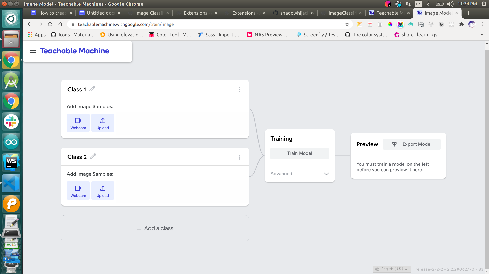
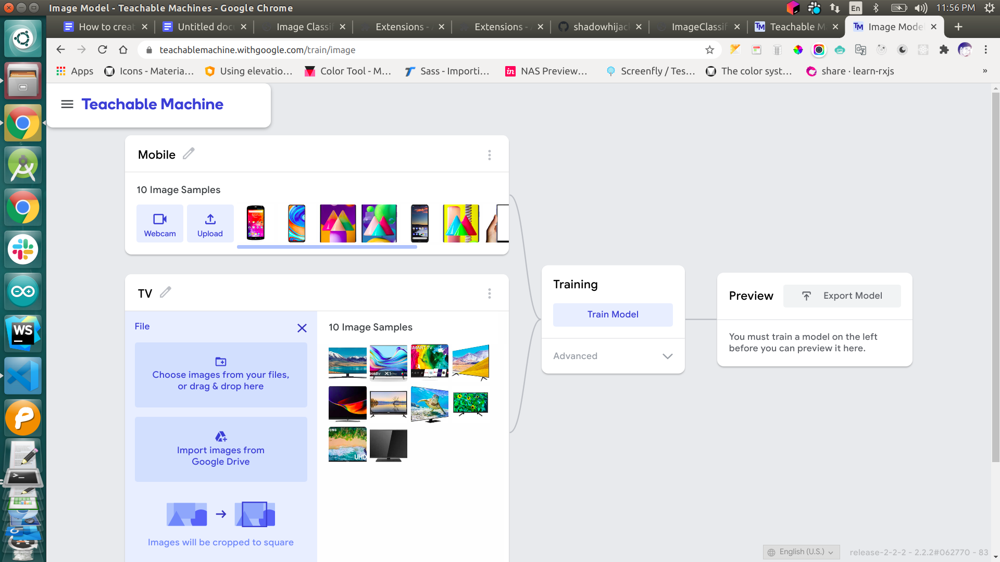
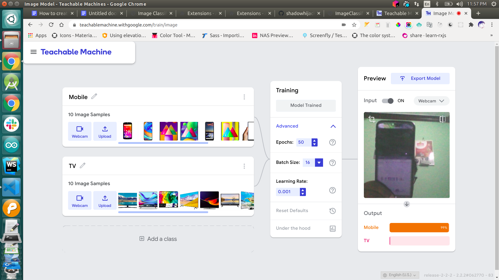
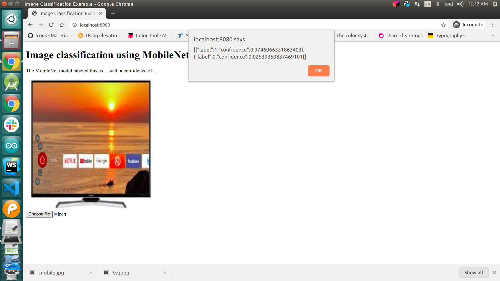

# custom-object-detection-model-in-js
Demonstrating custom object detection model in javascript using ml5 js and teachablemachine

# Introduction
If you are new to machine learning model or you don't know in deep about machine learning.
Here you don't need to worry about it because here we are going to create our object detection
with our custom machine model in javascript using ML5.js and teachable machines.


## Step 1: (Create Model)
  
  Go to teachable machine site and create a image project for create you image detection or image classification model.
 
 

 ## Step 2: (Train data)
  Now we need to create the categories and train the datasets. There are two categories(class) will be default in teachable machines. I just simply created with that two categories if you want to more you can creat it. After created the 
  categories you need to train the data by uploading the images respect to your class. here i have trained the images for `mobile` and `tv`.
  After uploaded the image click the `train model button` for train your model.

  > The accuracy is depends on how much training data feeding to this model. i have just simply loaded small amount of data.

 

 ## Step 3: (Test the model)

After training the model completion. you need to test the model for how it give the accuracy and how does it detect the object from the image. So you need to test it by either webcam or upload it. then you can see the accuracy of your trained model.

 

 ## Step 4: (Integrate it in your project)
   After the model trained and tested successfully you need to export your model. for that you need to click the  `export model` button. then the export popup will get open there the choose the tesorflow.js or p5.js option. then download and extract the zipped file in my_model folder.
   
   finally integrate your model in image classifier function of ml5.js.
 
 


# Source code:

## index.html
```html
<!DOCTYPE html>
<html>
   <head>
      <meta charset="UTF-8">
      <title>Image Classification Example</title>
      <script src="https://unpkg.com/ml5@0.3.1/dist/ml5.min.js" type="text/javascript"></script>
   </head>
   <body>
      <h1>Image classification using MobileNet</h1>
      <p>The MobileNet model labeled this as <span id="result">...</span> with a confidence of <span id="probability">...</span>.</p>
      
      <form>
         <input type="file" id="file"  onchange="detectImage()">  
      </form>
      <script src="sketch.js"> 
      </script>
   </body>
</html>
```

## Sketch.js
```js
let classifier;
let labels = ['mobile','tv'];

preLoad();


// Initialize the Image Classifier method with your // Custom  model
function preLoad() {
	classifier = ml5.imageClassifier('./my_model/model.json', modelLoaded);
}


function modelLoaded() {
	console.log('Model Loaded!');
}

// predict the result after uploaded
function detectImage() {
	var reader = new FileReader();
	reader.onload = function () {
		var output = document.getElementById('output_image');
		output.src = reader.result;
		classifier.classify(document.getElementById('output_image'), getResult);
	}

	reader.readAsDataURL(event.target.files[0]);

}

// result callback function
function getResult(err, results) {
	alert(JSON.stringify(results));
        alert("Predicted is :", labels[results[0].label]);
}
```

# Code Explanation

 initialize your label as per you created class in teachable machine. it will be in the metadata.json.
```js
 let labels = ['mobile','tv'];
```

 Load your model by setting the path in the ml5.imageClassifier	method. it will be load while your app load or when you call the prelaod function in your app.

```js
 classifier = ml5.imageClassifier('./my_model/model.json', modelLoaded);
```
after that when you upload image it will show the resulst in alert box.


Finally we have come to conclustion i this blog will be helpfull to you and enjoyed. if i missed anything or showed as wrong pls comment it. 